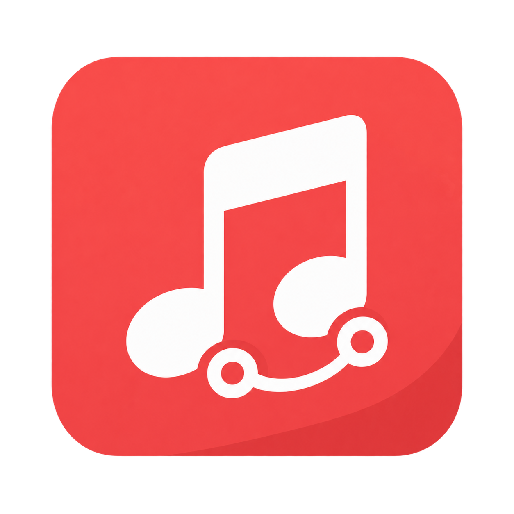
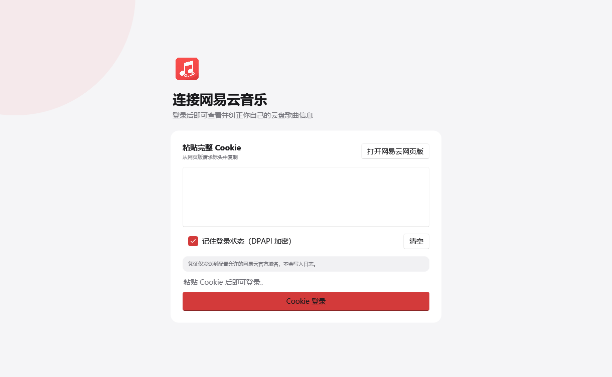
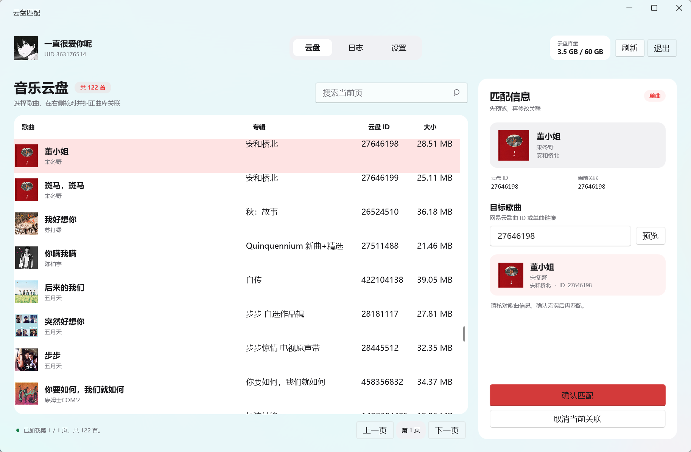
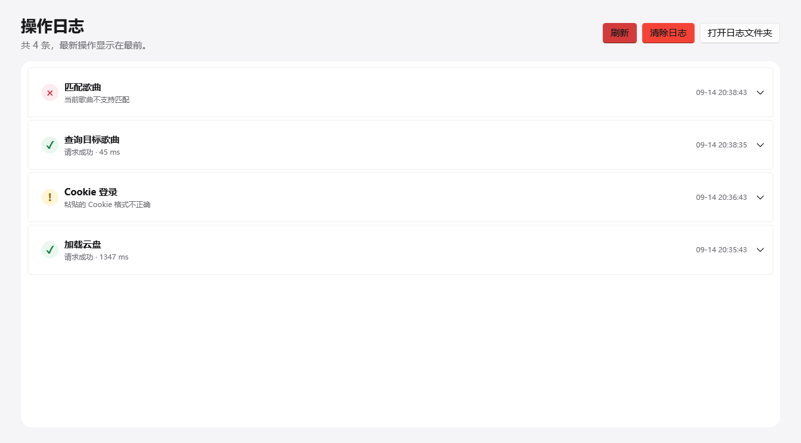
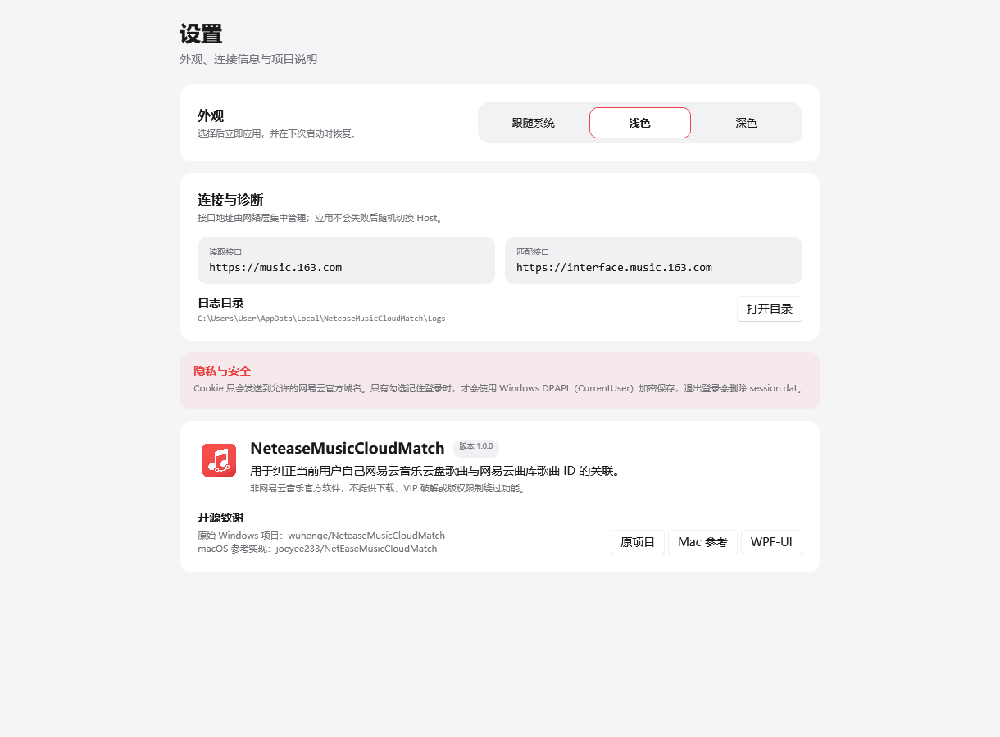
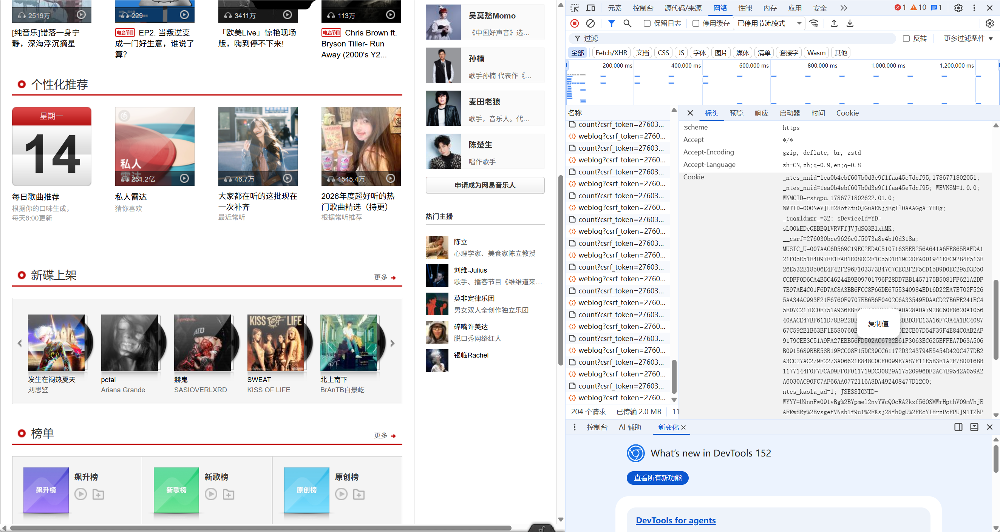

# NetEaseMusicCloudMatch

[](https://github.com/LuckyJie3/NetEaseMusicCloudMatch/actions/workflows/ci.yml)



NeteaseMusicCloudMatch 是一个非官方 Windows 桌面工具，用来纠正当前用户自己网易云音乐云盘歌曲与网易云曲库歌曲 ID 的关联。

它不是音乐下载器，不下载歌曲，不破解 VIP，也不绕过付费或版权限制。应用只调用网易云音乐网页使用过的私有接口；这些接口没有稳定性承诺，未来可能变化。

## 界面预览

以下截图由项目内置的离线预览器生成，使用的是演示账号与虚构歌曲数据，不包含真实 Cookie、UID 或用户日志。

<table>
  <tr>
    <th>Cookie 登录</th>
    <th>云盘列表与单曲匹配</th>
  </tr>
  <tr>
    <td></td>
    <td></td>
  </tr>
  <tr>
    <th>操作日志</th>
    <th>设置与项目信息</th>
  </tr>
  <tr>
    <td></td>
    <td></td>
  </tr>
</table>

## 功能

- 使用从网易云音乐网页版手工复制的完整 Cookie 登录；
- 显示昵称、UID、头像、云盘歌曲数量与容量；
- 分页显示云盘歌曲，支持当前页本地搜索；
- 接受纯数字歌曲 ID 或明确的网易云单曲 URL；
- 匹配前查询并显示目标歌曲封面、名称、歌手、专辑和 ID；
- 单曲确认匹配；
- 通过明确按钮和二次确认取消匹配；
- Windows DPAPI 加密保存可选登录状态；
- 面向普通用户的操作时间线，可展开 Endpoint、状态码、CorrelationId 和脱敏后的响应 JSON；
- 支持在二次确认后清除本机应用日志；
- WPF-UI Fluent 控件、应用内确认框和非阻塞结果提示；
- 浅色、深色与实时跟随系统主题。

## 系统要求

- Windows 10 或 Windows 11 x64；
- 推荐使用项目发布的 self-contained 版本，普通用户不需要安装 .NET SDK；
- 源码构建需要 .NET 10 SDK。

## 下载

前往 [GitHub Releases](https://github.com/LuckyJie3/NetEaseMusicCloudMatch/releases/latest) 下载最新的 `win-x64` 压缩包，解压后运行 `NeteaseMusicCloudMatch.App.exe`。

发布包为 Windows x64 自包含版本，不需要预先安装 .NET SDK。下载后可以使用 Release 中提供的 `SHA256SUMS.txt` 校验文件完整性。

## Cookie 登录教程

1. 启动软件，点击“打开网易云音乐网页版”。
2. 在浏览器中自行登录网易云音乐。
3. 按 `F12` 打开开发者工具，进入 **Network（网络）**。
4. 刷新网页或点击页面内容，可选择 **Fetch/XHR** 缩小请求范围。
5. 在请求列表中选择一个发往 `music.163.com` 的已登录请求，打开 **Headers（标头）**。
6. 在 **Request Headers（请求标头）** 中找到 `Cookie`，只复制冒号后面的完整值，不要包含 `Cookie:` 字样。
    
7. 回到软件，把 Cookie 粘贴到多行输入框。
8. 按需勾选“记住登录状态”，再点击“Cookie 登录”。

如果账号接口没有返回有效 profile，软件会提示：

> Cookie 无效或已过期，请重新登录网易云网页版后复制新的 Cookie。

> [!CAUTION]
> Cookie 等同于账号登录凭证。不要把 Cookie 发给任何人，也不要把真实 Cookie 写入 Issue、日志、截图、源码、`appsettings.json` 或命令行参数。截图 DevTools 前必须完全遮住 Cookie；如果怀疑 Cookie 已经泄露，请立即在网易云音乐退出登录并重新登录以刷新会话。

## 如何查找歌曲 ID

在网易云音乐网页版打开目标单曲页面。例如：

```text
https://music.163.com/#/song?id=186137
```

其中 `186137` 是歌曲 ID。软件也接受标准形式：

```text
https://music.163.com/song?id=186137
```

歌单、专辑和排行榜链接会被拒绝，避免把它们误认为单曲。

## 如何执行匹配

1. 登录后在云盘表格选择一首歌曲。
2. 在右侧“匹配信息”面板输入目标歌曲 ID 或单曲 URL。
3. 点击“预览”。
4. 核对封面、歌曲名、歌手、专辑和目标 ID。
5. 点击“确认匹配”，在二次确认中再次核对。

协议参数保持为：

```text
songId       = 当前云盘歌曲 ID
adjustSongId = 目标网易云曲库歌曲 ID
userId       = 当前登录账号 UID
```

写请求不会因为超时或 5xx 被盲目自动重试。如果结果不确定，请先刷新云盘核对状态。

## 如何取消匹配

选择云盘歌曲后点击右侧面板底部的“取消当前关联”，再在应用内确认框中确认：

> 确定要取消这首云盘歌曲当前的网易云曲库关联吗？

程序内部调用同一匹配协议并固定使用 `adjustSongId=0`。普通用户不需要手工输入 0。

## Cookie 安全

- Cookie 只由用户手工粘贴；应用不会读取 Chrome、Edge 或其他浏览器的 Cookie 数据库。
- Cookie 只会直接发送到配置允许的网易云官方 HTTPS host。
- HTTP 客户端禁用自动重定向，避免 Cookie 被跨 host 转发。
- 未勾选“记住登录状态”时，Cookie 只存在于进程内存。
- 勾选后使用 `ProtectedData` + `DataProtectionScope.CurrentUser` 加密，保存在 `%LOCALAPPDATA%\NeteaseMusicCloudMatch\session.dat`。
- 退出登录会删除 `session.dat`。
- 日志不记录 Cookie、Set-Cookie、Authorization、`MUSIC_U`、`__csrf`、`MUSIC_A` 或 `MUSIC_R_T` 的值。
- 接口响应 JSON 仅保存在本机日志中；凭证字段会替换为 `[REDACTED]`，超长字符串、深层对象和大型数组会截断。
- 应用不上传 Cookie 到第三方服务器，也不包含随机伪造 IP Header。

日志目录：

```text
%LOCALAPPDATA%\NeteaseMusicCloudMatch\Logs\
```

“操作日志”页可以展开查看格式化后的响应 JSON，也可以通过“清除日志”按钮清空滚动日志文件。清除日志不会删除 `session.dat`，也不会修改云盘歌曲。

## 操作日志

- 最新操作显示在最前，可以快速区分成功、警告和错误；
- 点击一条记录可以展开 Endpoint、HTTP 状态、网易云业务 code、CorrelationId 和接口响应 JSON；
- JSON 在写入日志前会脱敏并限制大小，超长数组和深层对象会省略；
- 应用启动、主题切换等本地事件没有接口响应 JSON，属于正常情况；
- “清除日志”会先要求确认，清除后仍会继续记录新的脱敏日志。

## FAQ

### Cookie 为什么登录失败？

Cookie 可能不完整、已经过期，或者复制自未登录请求。重新登录网页版，并从发往 `music.163.com` 的已登录请求复制完整 Request Header Cookie。

### HTTP 200 为什么仍提示登录失效？

网易云接口会在 HTTP 200 内返回业务 `code`。账号接口在无 Cookie 时甚至可能返回 `code=200` 但 `profile=null`。软件会同时检查 HTTP 状态、API code 和必要字段。

### 为什么找不到目标歌曲？

确认输入的是单曲 ID/URL。已被彻底删除的歌曲可能没有可用的详情数据；下架与删除也不是同一状态。

### 匹配失败后可以连续点击吗？

不要。软件会在一次写请求期间禁用重复操作，而且不会自动重试 Match/Cancel。请求结果不确定时先刷新当前页。

### 为什么读取和匹配使用不同 Host？

账号、云盘和歌曲详情继续使用源码与实测都能工作的 `music.163.com`。匹配写接口使用该功能原始抓包记录中的 `interface.music.163.com`。Host 都在 API 配置层集中管理；软件不会在一次写请求失败后自动换 Host 重试，也没有凭空加入 weapi/eapi 加密。

## 从源码构建

```powershell
dotnet restore NeteaseMusicCloudMatch.sln
dotnet build NeteaseMusicCloudMatch.sln --configuration Release --no-restore
dotnet test NeteaseMusicCloudMatch.sln --configuration Release --no-build --no-restore
```

运行开发版：

```powershell
dotnet run --project src/NeteaseMusicCloudMatch.App/NeteaseMusicCloudMatch.App.csproj
```

项目不依赖 Node.js、Python 或第三方 API Server。

## 发布 Windows x64

```powershell
./scripts/publish-win-x64.ps1
```

默认参数：

- `net10.0-windows`
- `win-x64`
- self-contained
- `PublishSingleFile=true`
- 不裁剪（WPF 稳定性优先）

输出目录：`artifacts/win-x64/`。

如果未来确认某个依赖在单文件模式有实际问题，应优先修改脚本发布成稳定目录，而不是牺牲可用性。

## 安全 API Probe

开发 Probe 位于 `tools/NeteaseMusicCloudMatch.ApiProbe/`。它只从进程环境变量 `NETEASE_MUSIC_COOKIE` 读取 Cookie，不会从源码、`appsettings.json` 或浏览器读取。

默认只读顺序：Account → Cloud List → Cloud by ID → Song Detail。没有环境变量时立即停止；输出不包含 Cookie。

```powershell
dotnet run --project tools/NeteaseMusicCloudMatch.ApiProbe -- --song-id=186137
```

Match/Cancel 不在默认 Probe 中。开发者必须显式提供 `--match` 或 `--cancel`、明确的云盘 ID，以及 `--confirm-write=I_UNDERSTAND`。真实账号写操作绝不会进入自动测试。

研究与实测状态见 [docs/RESEARCH.md](docs/RESEARCH.md) 和 [docs/API.md](docs/API.md)。2026-09-13 的用户侧脱敏日志已确认账号、云盘、云盘单曲和曲库歌曲详情读取成功；匹配写接口仍需按文档中的诊断结论继续人工复测。

## 项目架构

```text
NeteaseMusicCloudMatch.sln
├─ src/
│  ├─ NeteaseMusicCloudMatch.App/            WPF、WPF-UI、MVVM、Host、DI、Serilog
│  ├─ NeteaseMusicCloudMatch.Core/           模型、接口、解析、错误与脱敏
│  └─ NeteaseMusicCloudMatch.Infrastructure/ HttpClient、服务、DPAPI
├─ tools/
│  └─ NeteaseMusicCloudMatch.ApiProbe/       安全开发探针
├─ tests/
│  └─ NeteaseMusicCloudMatch.Tests/          xUnit + Mock HttpMessageHandler
├─ docs/
│  ├─ RESEARCH.md
│  └─ API.md
└─ scripts/
   └─ publish-win-x64.ps1
```

ViewModel 不直接使用 `HttpClient`。Endpoint、HTTP method 与 Base Host 由 Infrastructure 集中管理；所有网络功能使用 async/await 和 CancellationToken。

## 安全报告

请不要在公开 Issue、截图或日志中提交 Cookie、`MUSIC_U`、`__csrf`、Authorization 等登录凭证。发现安全问题时，请按照 [SECURITY.md](SECURITY.md) 使用 GitHub 的私密漏洞报告渠道。

## 开源许可与第三方权利

MIT License 只授权本仓库中依法可授权的源代码，不授予网易云音乐服务、私有接口、商标、歌曲资料、封面或其他第三方内容的任何权利。项目名称中对 NetEase/网易云音乐的提及仅用于说明兼容对象，不表示网易公司授权、认可或参与本项目。

依赖组件、参考实现和版权归属详见 [NOTICE.md](NOTICE.md)。

## Disclaimer

本项目与网易云音乐及其运营方没有隶属、授权或背书关系，不是官方软件。用户应只操作自己账号中的云盘歌曲，并自行承担使用私有接口可能因服务变化、账号策略或数据修改产生的风险。项目不提供任何版权规避能力。

## Credits

- 原始 Windows 项目及核心业务协议：[wuhenge/NeteaseMusicCloudMatch](https://github.com/wuhenge/NeteaseMusicCloudMatch)。研究时工作区中的源码快照来自 EVAyo fork，其 LICENSE 署名 Healer。
- macOS Cookie 登录与较新请求流程参考：[joeyee233/NetEaseMusicCloudMatch](https://github.com/joeyee233/NetEaseMusicCloudMatch)，LICENSE 署名 zhioak。
- Windows Fluent 控件、主题、ContentDialog 与 Snackbar：[WPF-UI](https://github.com/lepoco/wpfui)（MIT）。

新版没有移植旧项目的 WinForms 单体架构、HttpHelper、二维码 Timer、随机 IP Header 或明文凭证存储。

## License

[MIT](LICENSE)。保留参考项目原有版权归属与许可声明；网易云音乐相关商标及服务权利归其各自权利人所有。
